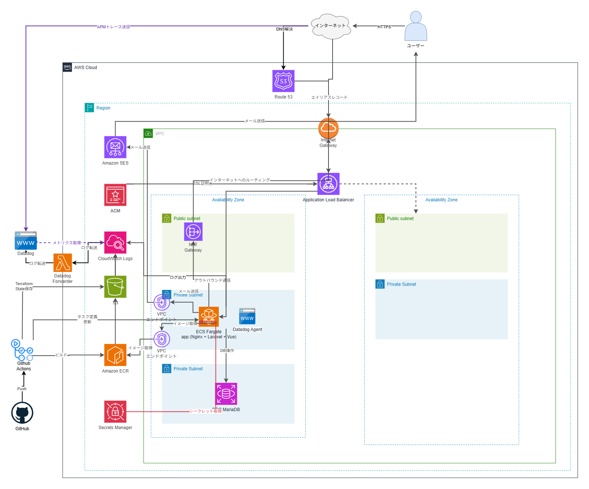

# ECサイト問い合わせ対応システム

## 概要
このシステムは、SREやインフラエンジニアとしてのスキルを身につけるためのポートフォリオです。架空のECサイト運営企業のカスタマーサポート業務を想定し、予測不可能なトラフィック変動への対応、SLO管理、監視体制の構築などSREの実務を実践しています。

## 想定企業情報
- **業種**: 中堅ECサイト運営企業
- **会社名**: 株式会社ライフスタイルマート
- **月間売上**: 10億円
- **会員数**: 30万人
- **取扱商品**: アパレル、雑貨、家電、インテリア、コスメ等
- **特徴**: 20-40代の女性をメインターゲット、セール・タイムセールを頻繁に実施
- **カスタマーサポート人数**: 8名

## 想定課題

**課題1: 問い合わせ対応の非効率性**
- 問い合わせの一元管理ができておらず、対応状況の把握が困難
- 重複対応や対応漏れが発生する可能性
- 優先度の高い問い合わせ（クレーム、返金要求等）の見落としリスク

**課題2: 対応品質のバラツキ**
- サポート担当者ごとに対応の質や速度にバラツキがある
- ベテランと新人で対応内容に差が出る
- 対応のベストプラクティスが共有されていない

**課題3: データ活用の困難さ**
- 問い合わせ内容や傾向の分析ができていない

## トラフィック想定

| 状況 | 発生頻度 | リクエスト数（req/s） |
|------|---------|-------------------|
| 通常時 | 常時 | 0.08 req/s |
| セール時 | 月2-3回 | 0.16 req/s |
| 配送トラブル | 年5-10回 | 0.4 req/s |
| 商品リコール | 年1-2回 | 0.8 req/s |

## 使用言語・開発環境
- **言語**: PHP 8.5.3／JavaScript
- **フレームワーク**: Laravel 12.51.0／Vue.js 3.5.28 
- **DB**：RDS (MariaDB11.8.5) 
- **インフラ**：AWS (ECS／Fargate／SES等)／Docker  
- **IaC**：Terraform  
- **CI／CD**：GitHub Actions  
- **モニタリング**／オブザーバビリティ：Datadog／CloudWatch  
- **開発支援**：Claude／Claude Code

## 工夫したところ

### 1. 本番Dockerイメージの軽量化

マルチステージビルドにより、本番イメージにはランタイムに必要なパッケージのみを含め、ビルド専用ツールや開発ツールを排除しています。

### 2. OSV-Scannerによる脆弱性スキャン

[OSV-Scanner](https://google.github.io/osv-scanner/)を使用して、Composer・npmの依存パッケージおよびDockerイメージの脆弱性スキャンを実施しています。スキャン結果に基づきDockerイメージを分析し、本番イメージの構成を最適化することでリスクレベルCritical1件・High4件の脆弱性を解消しました。

## 技術選定理由

本セクションでは、技術選定において意思決定が必要だった技術の選定理由を記載します。その他の技術については以下の理由で省略します：

- Laravel、Vue.js: インフラ学習が主目的のため、アプリケーション実装スピードを優先して選択
- Docker: コンテナ化は前提技術
- CloudWatch: Fargate利用時の標準ログ出力先として必須
- その他AWSサービス（Route 53、ACM、VPC等）: AWS利用時の標準的な選択

## 1. 技術スタック概要

| 技術 | 役割 |
|------|------|
| Laravel + Vue.js | 問い合わせ管理機能の実装 |
| Docker | アプリケーションのコンテナ化 |
| ECS/Fargate | コンテナの実行 |
| ALB | 負荷分散・SSL/TLS終端 |
| RDS (MariaDB) | 問い合わせデータの永続化 |
| Terraform | インフラのコード管理 |
| Datadog | メトリクス・ログ・APM統合監視 |
| CloudWatch | AWSメトリクス・ログの一次保存 |
| GitHub Actions | 自動テスト・デプロイ |

## 2. ECS/Fargate

### なぜECS/Fargateか

- **サーバー管理不要**: パッチ適用、OS更新等の運用負荷ゼロ
- **障害時の自動復旧**: タスク異常終了時にECSが自動再起動、ALBが異常タスクを切り離し
- **デプロイの簡略化**: 新しいタスク定義で無停止デプロイ、ロールバックも容易
- **コスト効率**: 使った分だけ課金、営業時間のみ稼働でコスト削減可能
- **コンテナ化のメリット**: Dockerfileによる構成管理で環境構築を再現可能

**他の選択肢**
- **EC2**: サーバー管理の運用負荷、パッチ適用等の作業が必要
- **EKS**: 学習コスト・運用コストが高く、小規模システムには過剰
- **Lambda**: Webアプリケーションの実行には不向き

## 3. Terraform

### なぜTerraformか

- **インフラ変更の安全性**: 事前確認で設定ミスを防止、Gitでコードレビュー可能
- **再現性**: コードから環境を再構築可能、災害復旧時も迅速に復元
- **ドキュメント化**: コードがそのまま仕様書、属人化を排除
- **変更履歴の記録**: Gitで誰が・いつ・何を変更したか追跡、ロールバック可能

## 4. ALB

### なぜALBか

- **固定エンドポイント**: Fargateタスク再起動でIPアドレスが変わっても、クライアントは同じURLでアクセス可能
- **ヘルスチェック・自動復旧**: 異常タスクを自動切り離し、ECSが新タスク起動
- **負荷分散**: 複数タスクに均等分散、スケールアウト時も自動対応
- **SSL/TLS終端**: ALBで一元管理、証明書更新も容易

## 5. RDS (MariaDB)

### なぜRDS (MariaDB)か

- **マネージドサービスの利便性**: パッチ適用、メンテナンス等の運用負荷削減
- **Laravelとの親和性**: 高い互換性、標準サポート

## 6. Datadog

### なぜDatadogか

- **統合監視**: ログ・メトリクス・トレースを1つのダッシュボードで把握（CloudWatchだと分断）
- **SLO管理**: 可用性99.5%、レイテンシ95%ile 1-3秒の達成状況を可視化、エラーバジェット自動計算
- **APM**: どの処理が遅いか特定、データベースクエリ実行時間の可視化、N+1問題の検知
- **トラブルシューティング時間の短縮**: 問題の原因特定が容易

## 7. CloudWatch

### なぜCloudWatchか

- **Fargate標準**: Fargateのログ出力先として必須
- **Datadogのデータソース**: AWSメトリクス・ログの一次ソース
- **コスト最適化**: 短期保存（7日間）のみ、長期分析はDatadogで実施

## 8. GitHub Actions

### なぜGitHub Actionsか

- **品質担保**: プルリクエストごとに自動テスト、テスト失敗時はデプロイを自動ブロック
- **属人化・手順ミスの排除**: 自動デプロイで手動作業を削減
- **デプロイ履歴**: いつ・誰が・何をデプロイしたか記録
- **GitHub連携**: ソースコード管理とCI/CDを同一プラットフォームで

## インフラ構成図



## 機能一覧

### 第1フェーズ（基本機能）

**顧客向け機能:**
- 問い合わせフォーム表示・送信
- 受付完了メール自動送信

**サポート担当者向け機能:**
- ログイン/ログアウト
- パスワード変更（管理者によるパスワードリセット後、初回ログイン時に変更を強制）
- 問い合わせ一覧表示・詳細表示
- ステータス管理（未対応・対応中・対応完了・クローズ）
- 優先度設定（低・中・高・緊急）
- 担当者割り当て
- 対応メモ追加（社内向け、顧客非公開）
- 返信メール作成・送信
- 顧客メッセージ手動登録（顧客から受信したメール内容をシステムに転記）
- 問い合わせ新規作成（電話受付対応）：電話での問い合わせを担当者がシステムに登録。受付区分（フォーム/電話）で問い合わせ経路を管理

**管理者向け機能:**
- 従業員管理（一覧・作成・編集・有効/無効切替・削除・パスワードリセット）
- カテゴリ管理（一覧・作成・編集・有効/無効切替・削除）

※顧客のメール返信は、担当者が「顧客メッセージ登録」機能でシステムに転記する運用（第2フェーズで自動化予定）

※AWS SESのサンドボックス解除が承認されていないため、本番環境での受付完了メール送信・返信メール送信はできません。

### 第2フェーズ（メール受信の自動化）

- 受信メール自動登録（AWS SES + Lambda + S3）

### 第3フェーズ（検索・分析機能）

- 検索・絞り込み・ソート

### 第4フェーズ（ダッシュボード）

- ダッシュボード（未対応件数、対応中件数等のサマリ表示）

## セットアップ

### 前提条件
- AWS CLI設定済み
- Terraform インストール済み
- Docker インストール済み

### 手順

1. リポジトリのクローン
```bash
git clone git@github.com:pomepome0505/ec-contact.git
cd ec-contact
```

2. ローカル開発環境の起動
```bash
docker compose up -d --build
```
初回起動時、`entrypoint-dev.sh` が自動で依存パッケージのインストール・DB マイグレーション等を実行します。

| サービス | URL |
|---------|-----|
| アプリケーション | http://localhost |
| phpMyAdmin | http://localhost:8080 |
| MailHog | http://localhost:8025 |

3. インフラ構築（Terraform）
```bash
cd terraform
terraform init
terraform plan
terraform apply
```
tfstateはS3バックエンド（`lmi-prod-s3-terraform-state`）で管理しています。