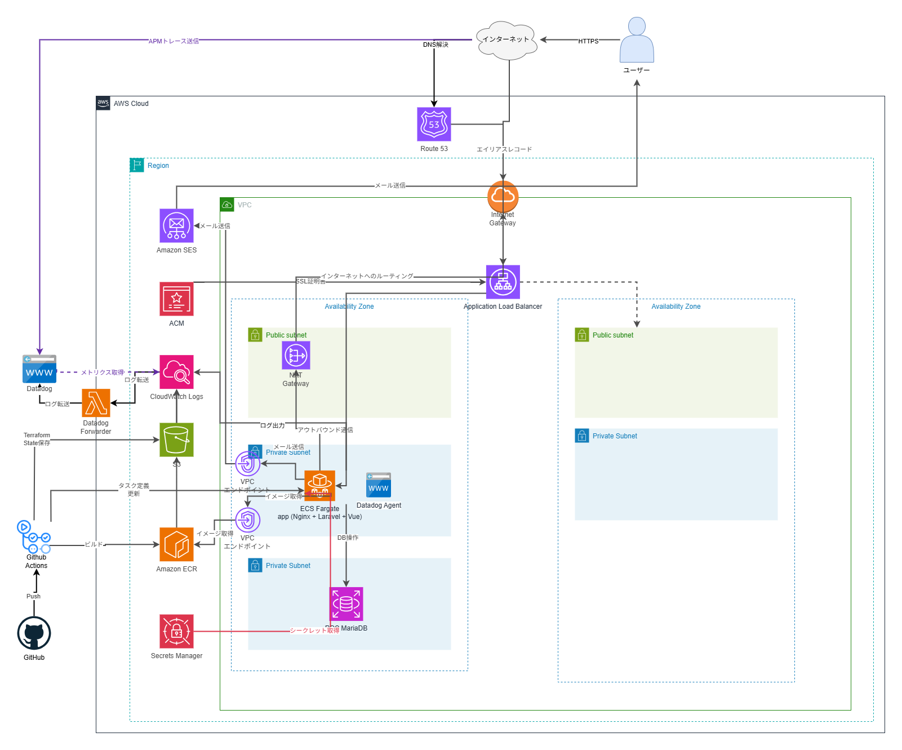
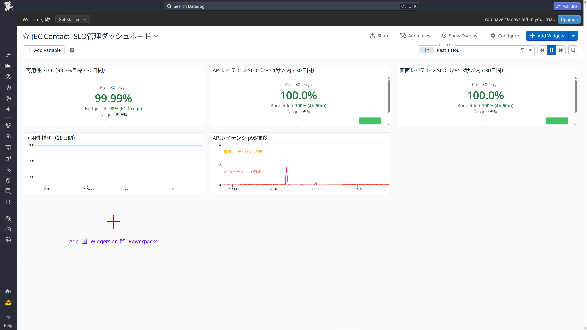
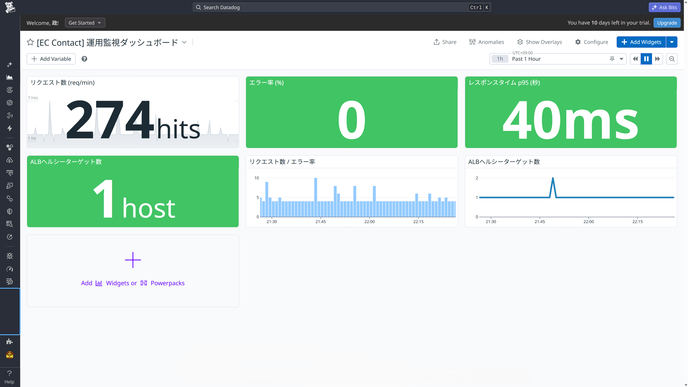
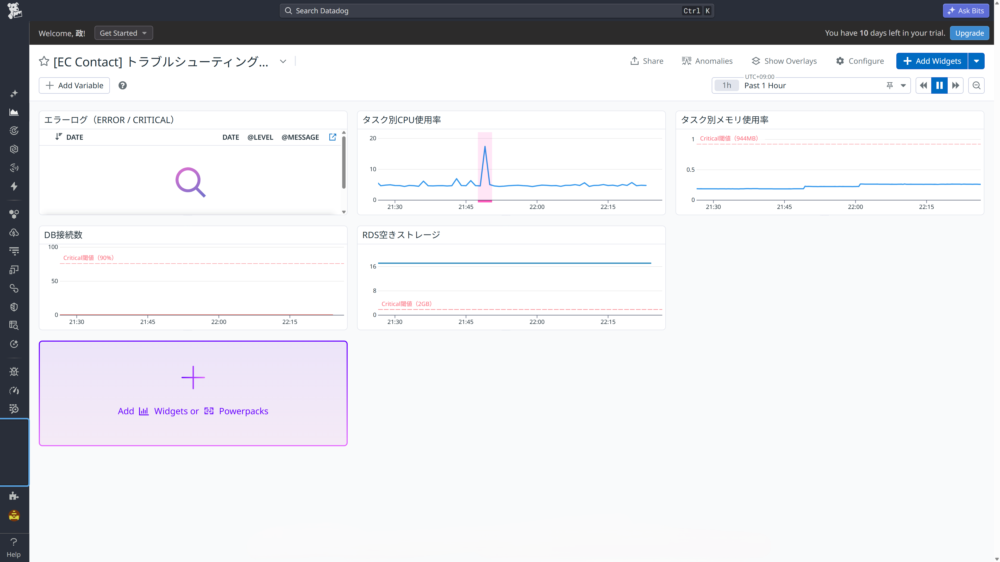

# ECサイト問い合わせ対応システム

## 概要

架空のECサイト運営企業「株式会社ライフスタイルマート」のカスタマーサポート業務向け問い合わせ管理システムです。セール時や配送トラブル時のトラフィックスパイクを想定し、SLO定義・エラーバジェット管理・Datadogによる統合監視など、SREの実務に即したインフラ設計・運用設計を実践しています。

## 使用言語・開発環境

- **言語**: PHP 8.5.3 / JavaScript
- **フレームワーク**: Laravel 12.51.0 / Vue.js 3.5.28
- **DB**: RDS (MariaDB 11.8.5)
- **インフラ**: AWS (ECS/Fargate/SES等) / Docker
- **IaC**: Terraform
- **CI/CD**: GitHub Actions
- **モニタリング/オブザーバビリティ**: Datadog / CloudWatch
- **開発支援**: Claude / Claude Code

## デモ

| | URL |
|--|-----|
| 問い合わせフォーム | https://lifestyle-mart-inquiry.com/inquiry |
| 管理画面 | https://lifestyle-mart-inquiry.com |

**管理画面ログイン情報**

| ID | パスワード |
|----|----------|
| sato | P@ssw0rd321 |

## 背景

### 想定企業情報

- **業種**: 中堅ECサイト運営企業
- **会社名**: 株式会社ライフスタイルマート
- **月間売上**: 10億円
- **会員数**: 30万人
- **取扱商品**: アパレル、雑貨、家電、インテリア、コスメ等
- **特徴**: 20-40代の女性をメインターゲット、セール・タイムセールを頻繁に実施
- **カスタマーサポート人数**: 8名

### 想定課題

**課題1: 問い合わせ対応の非効率性**
- 問い合わせの一元管理ができておらず、対応状況の把握が困難
- 重複対応や対応漏れが発生する可能性
- 優先度の高い問い合わせ（クレーム、返金要求等）の見落としリスク

**課題2: 対応品質のバラツキ**
- サポート担当者ごとに対応の質や速度にバラツキがある
- ベテランと新人で対応内容に差が出る
- 対応のベストプラクティスが共有されていない

**課題3: データ活用の困難さ**
- 問い合わせ内容や傾向の分析ができていない

### トラフィック想定

| 状況 | 発生頻度 | リクエスト数（req/s） |
|------|---------|-------------------|
| 通常時 | 常時 | 0.08 |
| セール時 | 月2-3回 | 0.16 |
| 配送トラブル | 年5-10回 | 0.4 |
| 商品リコール | 年1-2回 | 0.8 |

## アーキテクチャ図

ECS/Fargate上でアプリコンテナとDatadog AgentをサイドカーとしてPrivate Subnetに配置し、インターネットアクセスはNAT Gateway経由に集約しています。外部公開はALBのみとしてセキュリティ境界を明確化し、ECRやSecrets Manager等のAWSサービスへのアクセスはVPCエンドポイント経由でインターネットを経由しない構成にしています。

## 工夫したところ

### 1. SLI/SLO定義とエラーバジェットに基づくリリース判断ルール

可用性99.5%、APIレイテンシ95%ile 1秒以内などのSLOを定義し、エラーバジェット残量に応じた4段階のリリース判断ルール（80%以上→積極リリース、20%未満→リリース凍結）を策定しました。これにより、信頼性とリリース速度のバランスを定量的に判断でき、属人的な意思決定を排除できる仕組みになっています。

### 2. 目的別3ダッシュボード設計とアラート設計

Datadogのダッシュボードを「SLO管理」「運用監視」「トラブルシューティング」の3種類に分け、使う場面と目的を明確に分離しました。また、アラートは「症状（可用性低下・レイテンシ悪化）」に対してのみ発火させ、「原因（CPU・メモリ）」はダッシュボードで調査する設計にしています。CPU使用率が高くてもサービスが正常なら問題ないため、原因系指標でのアラートは誤検知を招くという判断です。

**SLO管理ダッシュボード**（SLO達成状況・エラーバジェット管理）

**運用監視ダッシュボード**（リクエスト数・エラー率・レスポンスタイムのリアルタイム監視）

**トラブルシューティングダッシュボード**（CPU・メモリ・DB接続数・ストレージの詳細確認）

### 3. Datadog APMによるリクエストトレーシング

dd-trace-phpライブラリをアプリコンテナに組み込み、ECSタスク内にDatadog Agentをサイドカーコンテナとして配置することでAPMを実現しています。アプリコンテナはlocalhost経由でAgentにトレースを送信し、AgentがNAT Gateway・Internet Gateway経由でインターネットを通じてDatadogバックエンドに転送します。これにより、エンドポイントごとのレイテンシ・エラー率・DBクエリ実行時間をリクエスト単位で可視化できます。

### 4. Secrets Managerによるシークレット管理

APP_KEY・DB_PASSWORD・DD_API_KEYをAWS Secrets Managerで管理し、ECSタスク起動時に自動復号して環境変数として注入しています。ECSの `environment`（平文）ではなく `secrets`（ARN参照）を使うことでAWSコンソールから値が見えない状態にし、IAMポリシーでは読み取り権限を3つのシークレットARNのみに限定して最小権限を徹底しています。

### 5. GitHub Actions × OIDC認証によるセキュアなCI/CDパイプライン

GitHub ActionsからAWSリソースを操作する際、長期アクセスキーではなくOIDC認証による短命な一時認証情報を使用しています。信頼ポリシーでリポジトリ・ブランチを限定することで、不正なリポジトリからの利用も防止しています。アクセスキーの漏洩リスクとローテーション運用を根本的に排除しました。

### 6. ECSデプロイサーキットブレーカーによる自動ロールバック

ECSサービスにデプロイサーキットブレーカーを有効化し、デプロイ時に新タスクが正常に起動しなかった場合、自動的に前のタスク定義にロールバックされるようにしました。手動でのロールバック作業が不要になり、デプロイ失敗時の復旧時間を大幅に短縮しています。

### 7. 本番Dockerイメージの軽量化

マルチステージビルドにより、本番イメージにはランタイムに必要なパッケージのみを含め、ビルド専用ツールや開発ツールを排除しています。

### 8. OSV-Scannerによる脆弱性スキャン

[OSV-Scanner](https://google.github.io/osv-scanner/)を使用して、Composer・npmの依存パッケージおよびDockerイメージの脆弱性スキャンを実施しています。スキャン結果に基づきDockerイメージを分析し、本番イメージの構成を最適化することでリスクレベルCritical1件・High4件の脆弱性を解消しました。

### 9. 開発環境のワンコマンド自動セットアップによるトイル削減

`docker compose up` だけで、依存パッケージのインストール・APP_KEY生成・DBマイグレーション・Vite起動まで自動実行されるエントリポイントスクリプトを作成しました。各ステップにべき等性を持たせており、何度実行しても安全です。環境構築の手作業（トイル）を排除し、新規参画者がすぐに開発を開始できるようにしています。

## 技術選定理由

設計判断を伴う主要技術の選定理由を記載します。アプリケーション層（Laravel・Vue.js）はインフラ学習が主目的のため実装スピードを優先し、Docker・CloudWatch・Route 53等はコンテナ化やAWS標準構成として採用しています。以下では特にトレードオフを検討した技術を取り上げます。

### ECS/Fargate

- **サーバー管理不要**: パッチ適用、OS更新等の運用負荷ゼロ
- **障害時の自動復旧**: タスク異常終了時にECSが自動再起動、ALBが異常タスクを切り離し
- **デプロイの簡略化**: 新しいタスク定義で無停止デプロイ、ロールバックも容易
- **コスト効率**: 使った分だけ課金、営業時間のみ稼働でコスト削減可能
- **コンテナ化のメリット**: Dockerfileによる構成管理で環境構築を再現可能

**他の選択肢**: EC2（サーバー管理の運用負荷が必要）、EKS（小規模システムには過剰）、Lambda（Webアプリの実行には不向き）

### Terraform

- **インフラ変更の安全性**: 事前確認で設定ミスを防止、Gitでコードレビュー可能
- **再現性**: コードから環境を再構築可能、災害復旧時も迅速に復元
- **ドキュメント化**: コードがそのまま仕様書、属人化を排除
- **変更履歴の記録**: Gitで誰が・いつ・何を変更したか追跡、ロールバック可能

### ALB

- **固定エンドポイント**: Fargateタスク再起動でIPアドレスが変わっても、クライアントは同じURLでアクセス可能
- **ヘルスチェック・自動復旧**: 異常タスクを自動切り離し、ECSが新タスク起動
- **負荷分散**: 複数タスクに均等分散、スケールアウト時も自動対応
- **SSL/TLS終端**: ALBで一元管理、証明書更新も容易

### RDS (MariaDB)

- **マネージドサービスの利便性**: パッチ適用、メンテナンス等の運用負荷削減
- **Laravelとの親和性**: 高い互換性、標準サポート

### Datadog

- **統合監視**: ログ・メトリクス・トレースを1つのダッシュボードで把握（CloudWatchだと分断）
- **SLO管理**: 可用性99.5%、レイテンシ95%ile 1秒以内の達成状況を可視化、エラーバジェット自動計算
- **APM**: どの処理が遅いか特定、データベースクエリ実行時間の可視化、N+1問題の検知
- **トラブルシューティング時間の短縮**: 問題の原因特定が容易

### CloudWatch

- **Fargate標準**: Fargateのログ出力先として必須
- **Datadogのデータソース**: AWSメトリクス・ログの一次ソース
- **コスト最適化**: 短期保存（7日間）のみ、長期分析はDatadogで実施

### GitHub Actions

- **品質担保**: プルリクエストごとに自動テスト、テスト失敗時はデプロイを自動ブロック
- **属人化・手順ミスの排除**: 自動デプロイで手動作業を削減
- **デプロイ履歴**: いつ・誰が・何をデプロイしたか記録
- **GitHub連携**: ソースコード管理とCI/CDを同一プラットフォームで行える

## 機能一覧

### 第1フェーズ（基本機能）

**顧客向け機能:**
- 問い合わせフォーム表示・送信
- 受付完了メール自動送信

**サポート担当者向け機能:**
- ログイン/ログアウト
- パスワード変更（管理者によるパスワードリセット後、初回ログイン時に変更を強制）
- 問い合わせ一覧表示・詳細表示
- ステータス管理（未対応・対応中・対応完了・クローズ）
- 優先度設定（低・中・高・緊急）
- 担当者割り当て
- 対応メモ追加（社内向け、顧客非公開）
- 返信メール作成・送信
- 顧客メッセージ手動登録（顧客から受信したメール内容をシステムに転記）
- 問い合わせ新規作成（電話受付対応）：電話での問い合わせを担当者がシステムに登録。受付区分（フォーム/電話）で問い合わせ経路を管理

**管理者向け機能:**
- 従業員管理（一覧・作成・編集・有効/無効切替・削除・パスワードリセット）
- カテゴリ管理（一覧・作成・編集・有効/無効切替・削除）

※顧客のメール返信は、担当者が「顧客メッセージ登録」機能でシステムに転記する運用（第2フェーズで自動化予定）

※AWS SESのサンドボックス解除が承認されていないため、本番環境での受付完了メール送信・返信メール送信はできません。

### 第2フェーズ（メール受信の自動化）

- 受信メール自動登録（AWS SES + Lambda + S3）

### 第3フェーズ（検索・分析機能）

- 検索・絞り込み・ソート

### 第4フェーズ（ダッシュボード）

- ダッシュボード（未対応件数、対応中件数等のサマリ表示）
